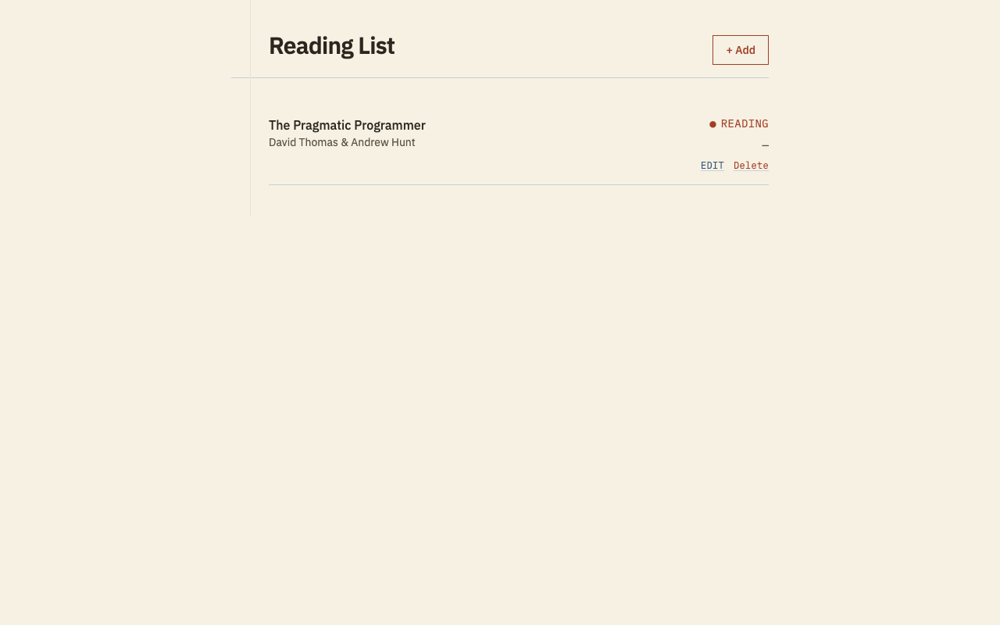

# Reading List

A client-only reading-list web app: add books you want to read, are reading, or have finished,
edit and delete them, and see your list persist across reloads — no backend, no accounts,
everything stored in the browser's LocalStorage.

## Stack

- React 19 + TypeScript (strict) via Vite
- React Router
- Tailwind CSS v4
- Vitest + React Testing Library
- LocalStorage persistence (no backend, no database)

## Getting started (Docker — recommended)

The project is Docker-first: every command below runs inside a disposable `node:22-alpine`
container, so nothing is installed on your host machine.

```bash
make install    # npm ci, inside the container
make dev        # start the dev server on http://localhost:5173
make test       # run the test suite (vitest run)
make lint       # eslint .
make lint-fix   # eslint . --fix, then prettier --write .
make build      # tsc -b && vite build -> dist/
make preview    # serve the production build on http://localhost:4173
```

## Getting started (without Docker)

If you're grading this project and don't have Docker installed, plain Node 22+ works too:

```bash
npm install
npm run dev       # http://localhost:5173
npm run test
npm run lint
npm run build
npm run preview   # http://localhost:4173
```

## Screenshots



## Live demo

<https://book-tracker-puce.vercel.app>

## Repository

<https://github.com/ArdaArslann/BookTracker>
